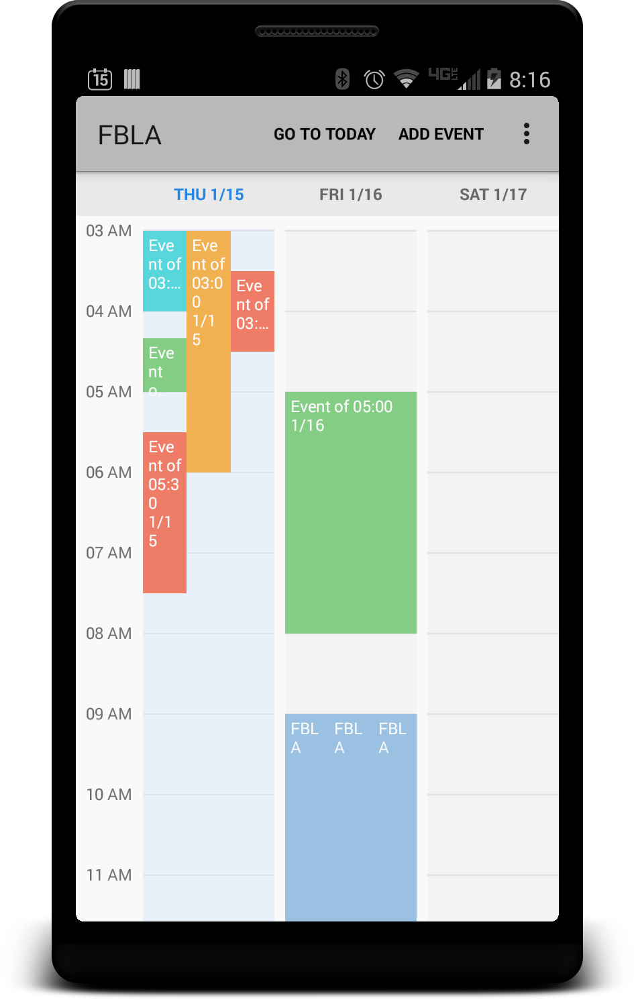
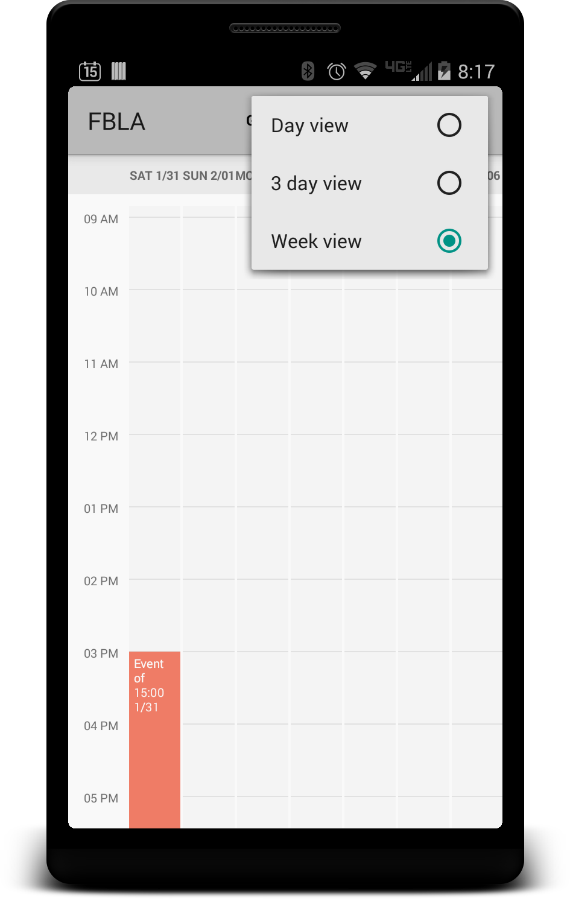
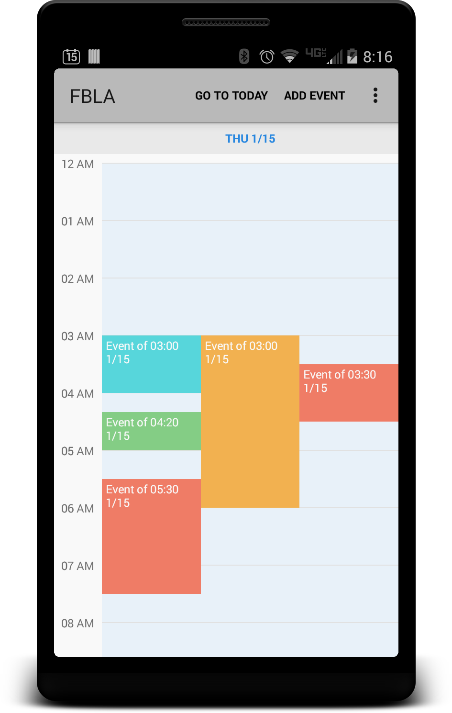
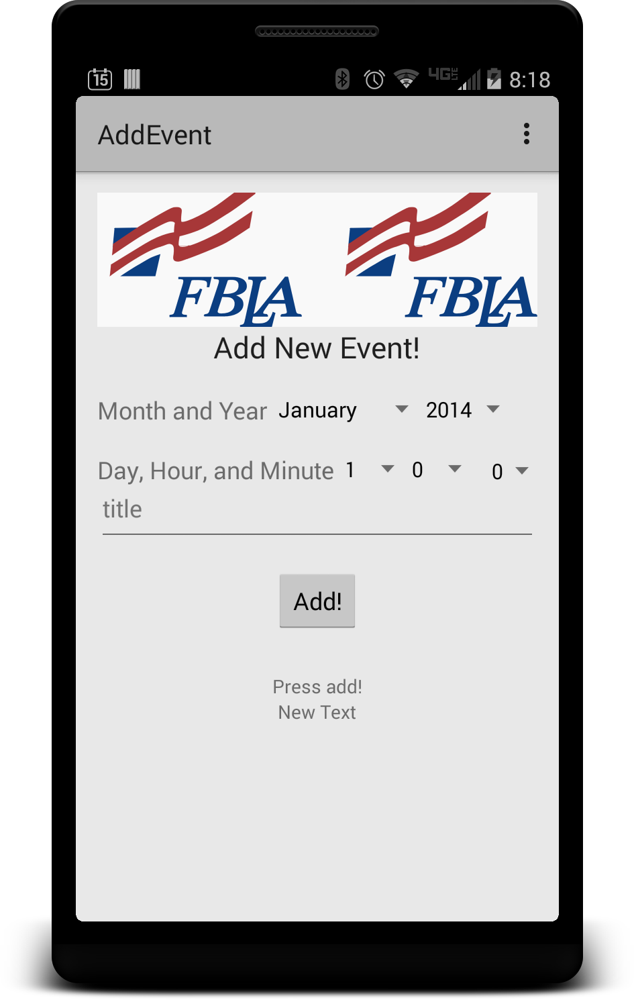
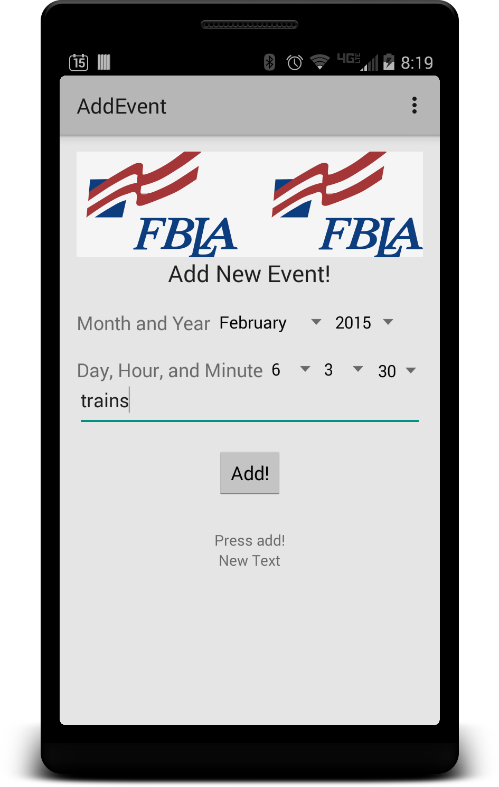
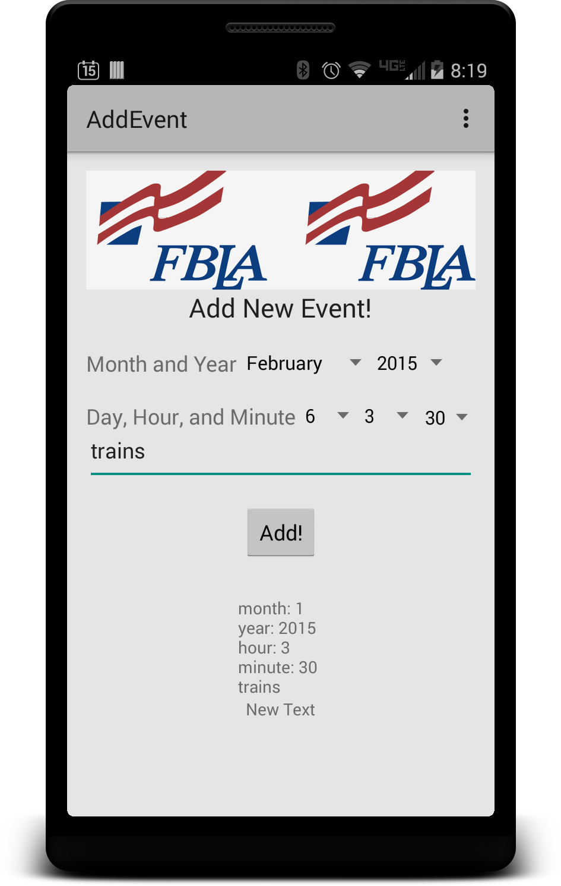
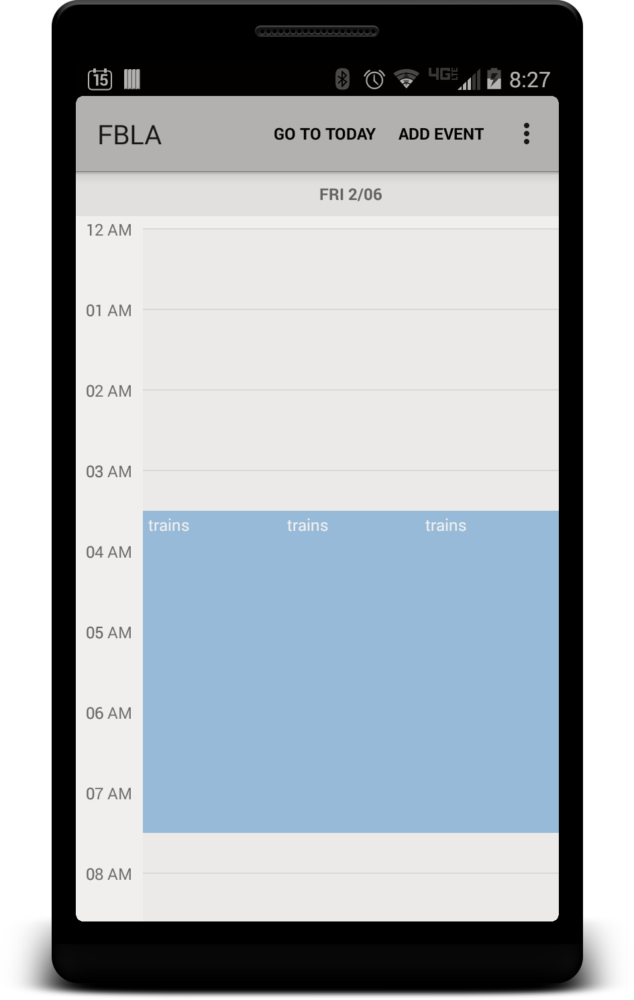

#EDGEWOOD FBLA MOBILE APPLICATION

This is a super neat app that allows you to add calendar events and view them in a nice way.

How to Use It
------------
This is a super simple calendar app. In the top right of the action bar, there's an option to set the display mode in the overflow menu. You can toggle between day view, 3 day view, and week view (7 days). You can scroll both vertically and horizontally to see different times and dates. If you ever get lost, you can always return to the current date by tapping on the today button in the action bar.

You can add an event by clicking on the add event button on the action bar. The add event screen has a banner image scroller at the top. You can pinch-to-zoom the image as well as pan around it. Adding an event is super easy. Simply enter the information you'd like in the appropiate data boxes, add a tile, and click add!

By pressing the back hardware button, you can return to the calendar and see the event you added!

